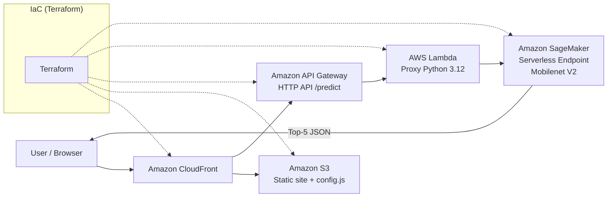

# SageMaker Serverless Demo (Mobilenet V2)


---

### 🌐 Live Demo
- **Website:** [https://ml-demo.store/](https://ml-demo.store/)
- **API Endpoint:** [`/predict`](https://222izyufsl.execute-api.us-east-1.amazonaws.com/predict)

---

## 📋 Overview

This is a **production‑style, serverless image classification** project on AWS.  
It deploys a pre‑trained **Mobilenet V2** on **Amazon SageMaker Serverless Inference**, exposed via **API Gateway + Lambda**, and a lightweight web UI served through **S3 + CloudFront**.  
Infrastructure is defined with **Terraform** and delivered in a reproducible, auditable way (state in **S3** with locking in **DynamoDB**).

---

## 🏗️ Architecture (High‑Level)

> Compact, GitHub‑safe Mermaid diagram with Terraform as the IaC orchestrator.



**Flow:** The user opens the site (CloudFront → S3) and sends `POST /predict` (API Gateway). Lambda forwards payloads to **SageMaker Serverless**, retrieves Top‑5 predictions, and returns them to the browser. **Terraform** provisions all components and their integrations.

---

## 📁 Project Structure

```plaintext
.
├── frontend/
│   ├── index.html
│   ├── script.js
│   ├── style.css
│   └── thomas.png
├── infra/
│   ├── api_and_config.tf
│   ├── backend.tf
│   ├── existing.tf
│   ├── iam_lambda_invoke.tf
│   ├── minimal.auto.tfvars
│   ├── model.tar.gz
│   ├── outputs.tf
│   ├── providers.tf
│   ├── sagemaker_deploy.tf
│   └── variables.tf
├── mobilenet_sls/
│   └── code/
│       ├── inference.py
│       └── requirements.txt
├── scripts/
│   └── inference_proxy.py
└── README.md
```

> **Terraform State:** stored remotely in **Amazon S3** (AES‑256 encrypted) with **DynamoDB** table for state locking. This prevents concurrent applies and guarantees consistency across team and CI/CD runs.

---

## ⚙️ Components

- **Frontend (S3 + CloudFront)** — static, cached globally; `config.js` auto‑updated with the current API URL.  
- **API Layer (API Gateway HTTP API)** — thin, cost‑efficient edge for POST `/predict`.  
- **Lambda Proxy (Python 3.12)** — forwards JSON payloads to **SageMaker Runtime** `InvokeEndpoint`.  
- **SageMaker Serverless Endpoint** — Mobilenet V2 (ImageNet); scales transparently with pay‑per‑ms billing.  
- **Terraform IaC** — single source of truth for infra, roles, permissions and wiring.

---

## 🔒 Security & IAM

- **KMS & Lambda env:** updates reset KMS binding and environment variables in a controlled order to avoid stale encryption state.  
- **Least‑privilege IAM:**  
  - *SageMaker execution role* — read model artifacts from S3 and pull images from ECR (read‑only).  
  - *Lambda execution role* — only `sagemaker:InvokeEndpoint` on the specific endpoint ARN.  
  - *API Gateway → Lambda permission* — scoped to `POST /predict` for this API.

---

## 💰 Cost Optimization

- **SageMaker Serverless** — billed per request time (ms). No idle compute.  
- **Lambda + HTTP API** — usage‑based and scales to zero; tune timeout/memory for latency vs cost.  
- **CloudFront + S3** — global caching for static assets, reduced S3 reads and latency.  
- **Artifacts** — compact, versioned model package to speed up deploys and minimize storage.

Typical demo‑level spend: **~$1–1.5/month**.

---

## 🚀 Deploy / Destroy (quick)

```bash
cd infra
terraform apply -auto-approve
# ...
terraform destroy -auto-approve
```
> If you orchestrate SageMaker through CLI in `null_resource`, ensure your destroy path also removes endpoint/config/models; or switch to native Terraform SageMaker resources for full lifecycle control.

---

## 🧰 Tech

AWS: SageMaker, Lambda, API Gateway (HTTP), CloudFront, S3, IAM, KMS  
Infra: Terraform ≥ 1.6 (AWS provider ≥ 5.50)  
Model: Mobilenet V2 (PyTorch, ImageNet)  
Frontend: HTML / CSS / JS

---

## 📜 License

MIT © Ruslan
