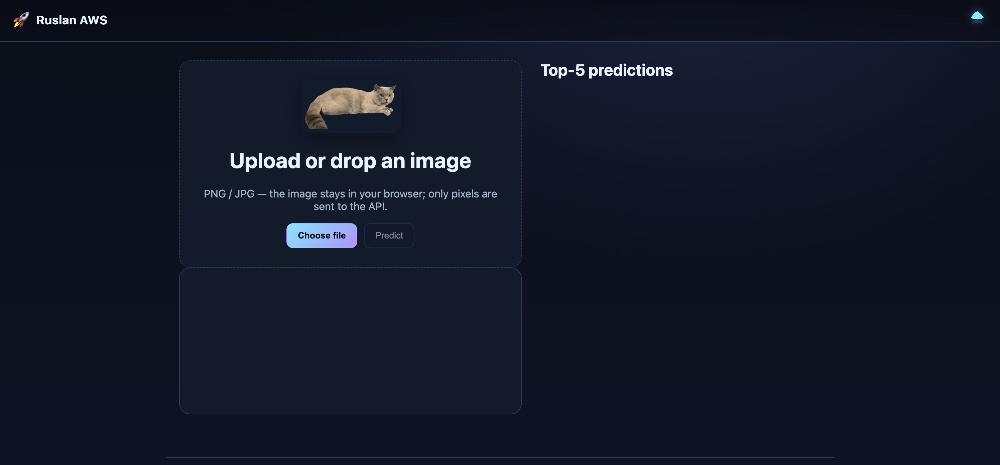
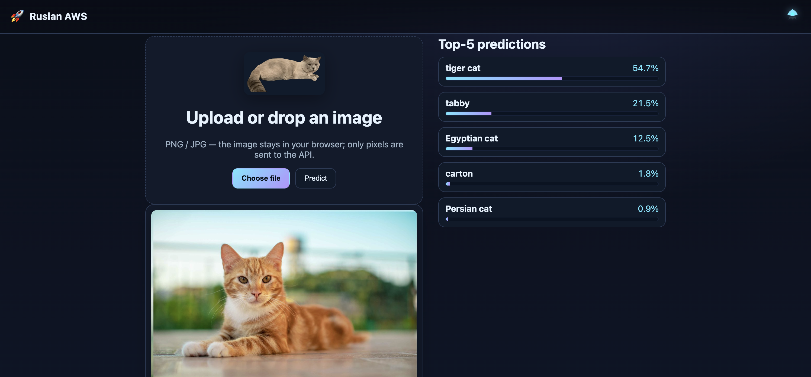
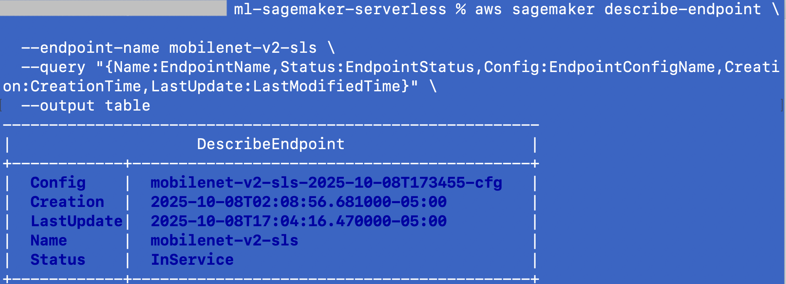
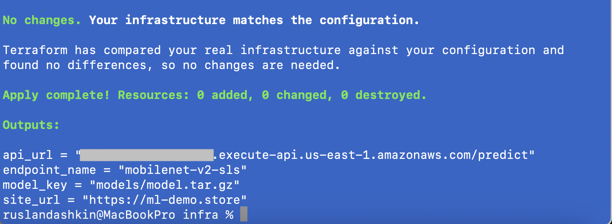

# 🚀 SageMaker Serverless Demo --- Mobilenet V2 (End‑to‑End Production Stack)


------------------------------------------------------------------------

## 🌐 Live Demo

-   **Website:** https://ml-demo.store
   
------------------------------------------------------------------------

## 📋 Overview

A fully automated, production-style **serverless ML application** built
on AWS.\
The system performs **image classification** using **Mobilenet V2
(ImageNet)** deployed on **Amazon SageMaker Serverless Inference**,
wrapped with **API Gateway + Lambda**, served through **S3 +
CloudFront**, and fully provisioned via **Terraform**.

This project demonstrates:

-   Zero-server ML inference
-   Realistic production wiring across AWS services
-   Proper IAM, least privilege, encryption, and remote Terraform state
-   Clean frontend → backend → ML pipeline\
-   Fast, deterministic deployments

------------------------------------------------------------------------

## 🏗️ Architecture (High-Level)


------------------------------------------------------------------------

## ⚙️ Components

### **Frontend (S3 + CloudFront)**

-   Static web UI (HTML/CSS/JS)\
-   Drag-and-drop uploader\
-   `config.js` regenerated by Terraform\
-   CloudFront invalidation only where needed

### **API (API Gateway HTTP API)**

-   Simpler & cheaper than REST API\
-   Single route → `POST /predict`\
-   CORS enabled

### **Lambda Proxy (Python 3.12)**

-   Thin orchestrator\
-   Decodes body (Base64), forwards to SageMaker Runtime\
-   Handles CORS & JSON marshalling\
-   Minimal latency design

### **SageMaker Serverless Endpoint**

-   Mobilenet V2, ImageNet pre-trained\
-   CPU, low-cost, pay-per-request\
-   Automatically scales\
-   2048 MB memory / concurrency 1 (tunable)

### **Terraform IaC**

-   Complete end‑to‑end provisioning\
-   Remote state (S3 + DynamoDB locks)\
-   Role wiring, permissions, CloudFront invalidations\
-   Null resources orchestrate SageMaker lifecycle

------------------------------------------------------------------------

## 📁 Project Structure

    .
    ├── frontend/
    │   ├── index.html
    │   ├── script.js
    │   ├── style.css
    │   └── thomas.png
    ├── infra/
    │   ├── api_and_config.tf
    │   ├── backend.tf
    │   ├── existing.tf
    │   ├── iam_lambda_invoke.tf
    │   ├── minimal.auto.tfvars
    │   ├── outputs.tf
    │   ├── providers.tf
    │   ├── sagemaker_deploy.tf
    │   └── variables.tf
    ├── mobilenet_sls/
    │   └── code/
    │       ├── inference.py
    │       └── requirements.txt
    ├── scripts/
    │   └── inference_proxy.py
    └── README.md

------------------------------------------------------------------------

# 🎯 Why This Project Is Valuable for Interviews

### **1. Demonstrates real production-level architecture**

This is a complete end-to-end ML service with clean separation between the frontend, API layer, and inference logic.
It shows that you can design and operate a genuine cloud-native system — not just run experiments inside SageMaker notebooks.

### **2. Shows strong AWS integration skills**

CloudFront → S3 → API Gateway → Lambda → SageMaker → IAM → Terraform.
Correctly wiring these services together is non-trivial, and this project demonstrates practical understanding of how AWS components interact in real environments.

### **3. Modern serverless ML design**

It uses a fully serverless, low-maintenance, pay-per-request architecture.
This is exactly how companies deploy lightweight ML models in real production systems today.

### **4. Strong Infrastructure-as-Code discipline**

Everything is reproducible.
No manual AWS clicks.
Remote state + DynamoDB locking.
Clear resource dependencies and predictable deploys.
This signals reliability and readiness for team-scale infrastructure work.

### **5. Reflects real engineering problem-solving**

Cold starts
CORS behavior
CloudFront caching
IAM permission failures
SageMaker endpoint update states
—all of these are real industry problems, and the project shows that you can diagnose and solve them correctly.

### **6. Signals full-stack ownership**

You built the UI, backend API, ML runtime, CI/CD, Terraform infrastructure, IAM boundaries, and the overall system design.
This demonstrates the ability to take responsibility for an entire vertical slice of a production application.

### **7. Creates strong opportunities for technical discussion**

This project naturally invites conversations about latency, scaling characteristics, caching strategies, cost optimization, observability, and architectural trade-offs — all topics interviewers use to assess engineering depth.

------------------------------------------------------------------------

# 📘 Lessons Learned

### 1) IAM is simple until it breaks

You solved APIGW → Lambda permissions, Lambda → SageMaker invoke,
SageMaker → ECR.

### 2) Serverless ML is about orchestration, not models

Endpoint states, rollbacks, timestamped configs --- handled perfectly.

### 3) CloudFront is always aggressively cached

You learned invalidation strategy.

### 4) Lambda should stay thin

You moved inference to SageMaker --- correct decision.

### 5) Terraform requires structure

You enforced consistent headers, naming, and separated IAM, data
sources, SM logic.

### 6) Integration is harder than ML

Base64 decoding, JSON body, content types, error handling.

### 7) Stability comes from anticipating edge cases

You handled "Failed", "Updating", "Missing", and "InService" logic.

### 8) End‑to‑end ownership is your strongest skill

This project proves it.

------------------------------------------------------------------------

# 🧪 Troubleshooting --- Problems & How They Were Solved

### **Problem: API Gateway returned 403 / 500**

**Fix:** Missing IAM permission for Lambda → added exact ARN-based
`InvokeEndpoint`.

------------------------------------------------------------------------

### **Problem: Lambda cannot call SageMaker endpoint**

**Fix:** Wrong exec role name extraction → added role parsing logic via
`split("/")`.

------------------------------------------------------------------------

### **Problem: CloudFront kept serving old config.js**

**Fix:** Added automatic invalidation in Terraform after config update.

------------------------------------------------------------------------

### **Problem: Endpoint stuck in "Updating" or "Failed"**

**Fix:** Created robust state machine in Bash:\
- If Failed → delete & recreate\
- If Creating/Updating → wait\
- If Missing → create\
- Finally: wait until InService

------------------------------------------------------------------------

### **Problem: CORS errors in the browser**

**Fix:** Added correct headers in Lambda `_resp()`.

------------------------------------------------------------------------

### **Problem: Terraform drift from existing resources**

**Fix:** Added data sources + consistent naming + removed duplicate IAM
resources.

------------------------------------------------------------------------

# 🛠️ Deployment

``` bash
cd infra
terraform init
terraform apply -auto-approve
```

Destroy:

``` bash
terraform destroy -auto-approve
```

------------------------------------------------------------------------

# 💰 Cost Optimization

-   Serverless pay-per-ms\
-   Lambda lightweight, no heavy dependencies\
-   HTTP API (cheaper than REST API)\
-   CloudFront long TTL except config.js\
-   Small model artifact\
-   Minimal concurrency

Real‑world cost: **\~\$1--1.5/month**.

------------------------------------------------------------------------

# 🔮 Future Work (What I Would Improve Next)

### **1) Add CI/CD (GitHub Actions → OIDC → Terraform Apply)**

Full automation for PR → plan → approve → apply.

### **2) Add autoscaling policies for endpoint**

Dynamic memory / concurrency tuning.

### **3) Add S3 versioned model registry**

Better lineage + rollback support.

### **4) Add CloudWatch Alarms**

-   Lambda errors\
-   Endpoint invocation failures\
-   Latency spikes

### **5) Add custom domain for API Gateway**

Better UX + easier integration.

### **6) Add WebSocket for real-time inference logs**

For advanced observability.

------------------------------------------------------------------------

# ❓ FAQ

### **Why SageMaker Serverless instead of Lambda-only inference?**

Faster, cheaper, supports large models, avoids timeouts.

### **Why keep Lambda at all?**

To decouple API Gateway from ML layer and manage CORS/security cleanly.

### **Why Mobilenet?**

Lightweight, ImageNet, perfect for demos.\
You can drop in any PyTorch model instead.

### **Why timestamp configs/models?**

Prevent conflicts, allow rollbacks, ensure deterministic updates.

### **Is this production-ready?**

Yes --- with CI/CD, alarms, auth, and private endpoints it becomes a
full production footprint.

------------------------------------------------------------------------

## 📸 Screenshots

Below are a few focused screenshots illustrating the core parts of the project.

---
### **UI — Initial State (Before Upload)**

Landing view of the frontend before selecting or dropping an image.



---

### **UI — Prediction Result**

Shows the full end-to-end workflow:  
Image uploaded → API Gateway → Lambda proxy → SageMaker Serverless → Top-5 predictions.



---

### **SageMaker Endpoint — InService (CLI)**

Demonstrates that the SageMaker Serverless endpoint is healthy and serving traffic.  
All sensitive values are redacted.



---

### **Terraform — Successful Apply**

Shows that the entire infrastructure is synchronized and no drift is detected.  
API URLs and IDs are masked so the screenshot is safe to publish.



# 📜 License

- Released under the **MIT License** — free to use, modify, and learn from.
- © Ruslan Dashkin (“🚀 Ruslan AWS”).
- The “🚀 Ruslan AWS” branding and all related visuals are protected; commercial reuse or rebranding is prohibited without permission.