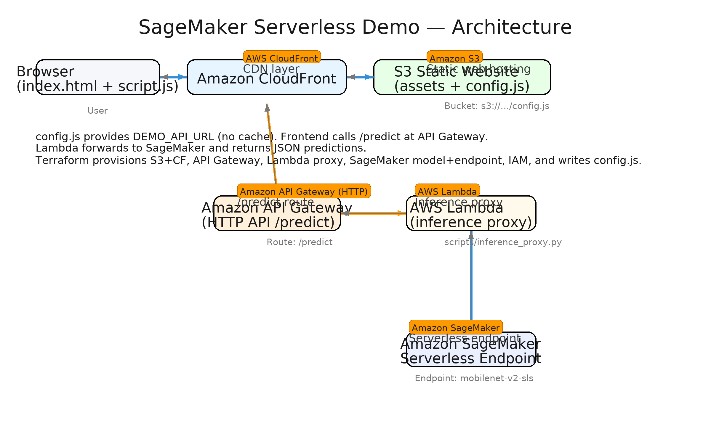

# 🧠 SageMaker Serverless Demo (Mobilenet V2)


---

## 📋 Overview

**SageMaker Serverless Demo (Mobilenet V2)** is a fully serverless image classification application that demonstrates how to deploy and expose a pre-trained ML model on AWS using Terraform.

It combines **Amazon SageMaker Serverless Endpoints**, **AWS Lambda**, **API Gateway**, **Amazon S3**, and **CloudFront** to deliver a cost-efficient, scalable, and production-ready architecture.

---

## 🏗️ Architecture

<p align="center">
  
</p>

### Flow Summary

1. **User** opens the web UI served via **S3 + CloudFront**.  
2. The frontend JavaScript loads `config.js` with the latest API URL.  
3. The browser calls `POST /predict` → **API Gateway (HTTP)**.  
4. **Lambda (inference proxy)** forwards the image URL to **SageMaker Serverless Endpoint**.  
5. The **Mobilenet V2** model predicts the image label.  
6. The result is returned to the browser as JSON.

---

## ✨ Features

- Fully **serverless architecture**
- **Pay-per-inference** cost model (no idle compute)
- Automated deployment via **Terraform**
- **Secure IAM roles** with least privilege
- **Static website hosting** with CloudFront CDN
- Instant API updates via `config.js` and cache invalidation

---

## 🚀 Deployment

### Prerequisites
- AWS CLI configured with appropriate credentials  
- Terraform >= 1.5  
- A pre-trained model archive: `model.tar.gz` (Mobilenet V2)  

### Steps

```bash
cd infra
terraform init
terraform apply -auto-approve
```

The comments for the commands above are intentionally placed **below** the block per your style preference.

After apply, Terraform will:  
- Create IAM roles for SageMaker and Lambda  
- Deploy the SageMaker model and endpoint (serverless)  
- Configure API Gateway + Lambda proxy integration  
- Upload `config.js` and invalidate CloudFront cache  

The static web app becomes available via the CloudFront domain.

---

## 🧹 Cleanup

```bash
cd infra
terraform destroy -auto-approve
```

The comment for the command above is intentionally placed **below** the block per your style preference.

---

## 💰 Cost Optimization

| Service | Optimization Strategy | Description |
|----------|----------------------|--------------|
| **SageMaker** | Serverless Inference | Pay only for invocation time (no EC2 hosting) |
| **Lambda** | Ephemeral execution | Scales automatically with requests |
| **CloudFront** | CDN caching | Reduces S3 read and bandwidth costs |
| **S3** | Static hosting | Very low cost for HTML/JS assets |
| **API Gateway** | HTTP API | Cheaper and faster than REST API |
| **Terraform** | Automated teardown | Easily destroy resources to stop billing |

💡 *Tip:* You can use wake/sleep scripts or CI/CD triggers to deploy only during testing hours.

---

## 🔮 Future Improvements

- Add **CI/CD pipeline** via GitHub Actions for automated deploys  
- Implement **authentication** (e.g., Cognito or IAM authorizers)  
- Integrate **CloudWatch monitoring** for endpoint metrics  
- Add **custom model training** and auto-upload to S3  
- Introduce **multi-model endpoints** for dynamic model loading  
- Optional **frontend enhancements** (drag & drop image upload, progress bar)

---

## 🧰 Tech Stack

| Category | Technology |
|-----------|-------------|
| **IaC** | Terraform |
| **ML Hosting** | Amazon SageMaker Serverless |
| **API Layer** | API Gateway (HTTP) + AWS Lambda |
| **Frontend** | Amazon S3 + CloudFront |
| **Language** | Python 3.10 |
| **Infrastructure** | AWS (IAM, CloudWatch, S3, Lambda, SageMaker, API Gateway) |

---

## 📂 Folder Structure

```
ml-sagemaker-serverless/
├── frontend/                 # Static site (HTML, JS, CSS)
│   ├── index.html
│   ├── script.js
│   └── style.css
├── infra/                    # Terraform IaC (SageMaker, Lambda, API Gateway, S3, CF)
│   ├── providers.tf
│   ├── variables.tf
│   ├── sagemaker_deploy.tf
│   ├── api_and_config.tf
│   ├── iam_lambda_invoke.tf
│   ├── outputs.tf
│   └── minimal.auto.tfvars
├── mobilenet_sls/
│   └── code/
│       ├── inference.py
│       └── requirements.txt
├── scripts/
│   └── inference_proxy.py
└── docs/
    ├── sagemaker-serverless-architecture.png
    └── sagemaker-serverless-annotated.png
```

---

## 🪪 License

This project is distributed under the MIT License — feel free to use, modify, and adapt it for your own learning or deployment demos.

---

> Designed for demonstration and portfolio purposes.  
> Shows how to deploy a production-ready **serverless ML inference pipeline** using modern AWS services.
