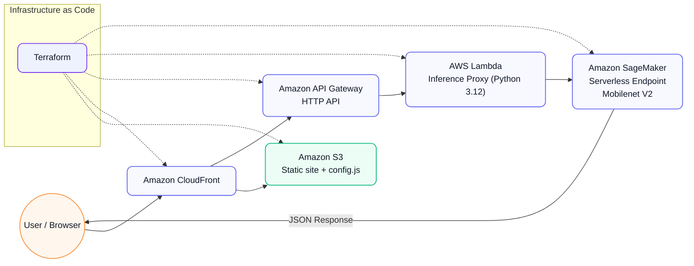

# SageMaker Serverless Demo (Mobilenet V2)


---

### 🌐 Live Demo
- **Website:** [https://ml-demo.store/](https://ml-demo.store/)
- **API Endpoint:** [`/predict`](https://222izyufsl.execute-api.us-east-1.amazonaws.com/predict)
- **Model:** Mobilenet V2 (Image Classification)

---

## 📋 Overview

This project demonstrates an **end-to-end serverless image classification pipeline** on AWS.  
It uses **Amazon SageMaker Serverless Inference** to host the pre-trained **Mobilenet V2** model, integrated with **API Gateway**, **Lambda**, and a **static web UI** deployed via **S3 + CloudFront** — all provisioned automatically with **Terraform**.

The goal is to show how to deploy a **production-ready ML inference system** that’s fast, scalable, and cost-efficient — perfect for portfolios, demos, or internal proof-of-concept setups.

---

## 🏗️ Architecture (High-Level)



**Flow:** User opens the static site (CloudFront → S3) → sends `POST /predict` via API Gateway → Lambda proxy forwards to **SageMaker Serverless** → predictions (Top‑5) returned as JSON to the browser.

---

## ⚙️ How It Works

1️⃣ **User Interface** — static `index.html + script.js` served via **CloudFront + S3**.  
2️⃣ **Config** — `config.js` holds the API URL and is served with **no‑cache** headers.  
3️⃣ **API Call** — browser sends a base64 image in JSON to **API Gateway** `POST /predict`.  
4️⃣ **Lambda Proxy** — receives JSON, calls **SageMaker Runtime** `InvokeEndpoint`.  
5️⃣ **SageMaker** — runs **Mobilenet V2** (ImageNet) on a **Serverless Endpoint**.  
6️⃣ **Response** — Lambda returns Top‑5 `{ label, prob }` predictions to the UI.

---

## 🔒 Security & IAM

This project follows AWS security best practices:

- **KMS (Key Management Service):**
  - The Lambda update process (`lambda_kms_clear`) deliberately clears the **KMS key** binding and resets environment variables during redeploys to avoid stale or invalid encryption state.
  - Configuration changes are applied only after the function reaches a stable status, reducing race conditions during updates.

- **IAM Roles (least privilege):**
  - **SageMaker Execution Role** (`*-sagemaker-exec`) — minimal permissions to **pull ECR images** (`AmazonEC2ContainerRegistryReadOnly`) and **read S3 model artifacts**.
  - **Lambda Execution Role** (`*-lambda-exec`) — a single inline policy granting **`sagemaker:InvokeEndpoint`** to **one specific endpoint ARN**.
  - **API Gateway → Lambda permission** — scoped to `POST /predict` for this API ID only.

These IAM and KMS practices minimize the blast radius and keep updates secure and auditable.

---

## 🚀 Deployment (Terraform)

**Prerequisites**
- AWS CLI configured
- Terraform ≥ 1.5
- A pre-trained `model.tar.gz` (Mobilenet V2) in the `infra/` directory

```bash
cd infra
terraform init
terraform apply -auto-approve
```
The comments for the commands above are intentionally placed below the block per your style preference.

Terraform provisions:
- IAM roles/policies and **Lambda permission** for API Gateway (scoped to `POST /predict`)  
- **S3 + CloudFront** for the static web app (with config auto‑generation and invalidation)  
- **API Gateway (HTTP API)** and the Lambda integration (unqualified ARN → latest version)  
- **SageMaker model + endpoint (serverless)** with tunable **Memory (MB)** and **Max Concurrency**

---

## 💰 Cost Optimization

This architecture is designed to **minimize cost while maintaining scalability and reliability**.  
All components are **event‑driven** and **pay‑per‑use**, so there are no idle infrastructure charges.

| Service | Optimization | Description |
|----------|---------------|-------------|
| **Amazon SageMaker** | **Serverless Inference** | Pay only for processing time (ms‑based). No EC2 instances or persistent compute. |
| **AWS Lambda** | **Ephemeral compute** | Executes on demand. Memory/timeout tuned for low latency and reduced billing. |
| **Amazon API Gateway** | **HTTP API** | Lightweight, ~cheaper than REST API for the same traffic profile. |
| **Amazon CloudFront** | **Global CDN Caching** | Caches static assets, reducing S3 reads and latency worldwide. |
| **Amazon S3** | **Static website** | Near‑zero cost hosting for frontend files. |
| **Terraform** | **On‑demand** | One‑command create/destroy to avoid charges outside demos. |

💡 *Result:* The whole pipeline typically costs **under $1–1.5/month** under light demo traffic, yet scales for spikes.

---

## 🧰 Tech Stack

| Category | Technology |
|-----------|-------------|
| **Infrastructure** | AWS (SageMaker, Lambda, API Gateway, S3, CloudFront, IAM, KMS) |
| **IaC** | Terraform |
| **Language** | Python 3.12 (Lambda) + Python 3.10 (inference) |
| **Frontend** | HTML, CSS, JavaScript |
| **Model** | Mobilenet V2 (Image classification, ImageNet) |

---

## 📂 Folder Structure

```plaintext
ml-sagemaker-serverless/
├── frontend/
│   ├── index.html
│   ├── out.json
│   ├── script.js
│   ├── style.css
│   └── thomas.png
├── infra/
│   ├── api_and_config.tf
│   ├── existing.tf
│   ├── iam_lambda_invoke.tf
│   ├── minimal.auto.tfvars
│   ├── model.tar.gz
│   ├── outputs.tf
│   ├── providers.tf
│   ├── sagemaker_deploy.tf
│   └── variables.tf
├── mobilenet_sls/
│   └── code/
│       ├── inference.py
│       └── requirements.txt
├── scripts/
│   └── inference_proxy.py
└── README.md
```

---

## 🧹 Cleanup

```bash
cd infra
terraform destroy -auto-approve
```
The comment for the command above is intentionally placed below the block per your style preference.

---

## 📜 License

MIT — Free to use, modify, and deploy for demos, learning, or portfolio purposes.
