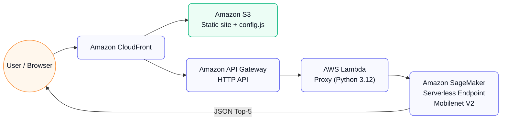

# SageMaker Serverless Demo (Mobilenet V2)


---

### 🌐 Live Demo
- **Website:** [https://ml-demo.store/](https://ml-demo.store/)
- **API Endpoint:** [`/predict`](https://222izyufsl.execute-api.us-east-1.amazonaws.com/predict)

---

## 📋 Overview

This project demonstrates an **end‑to‑end serverless image classification pipeline** on AWS.
It uses **Amazon SageMaker Serverless Inference** to host a pre‑trained **Mobilenet V2** model, integrated with **API Gateway**, **Lambda**, and a static web UI served via **CloudFront + S3** — all provisioned with **Terraform**.

---

## 🏗️ Architecture (High‑Level)



**Flow:** user opens the static site (CloudFront → S3) → sends `POST /predict` via API Gateway → Lambda forwards to **SageMaker Serverless** → predictions (Top‑5) returned to the browser.

---

## 📁 Project Structure

```plaintext
.
├── frontend/
│   ├── index.html
│   ├── script.js
│   ├── style.css
│   └── thomas.png
├── infra/
│   ├── api_and_config.tf
│   ├── backend.tf
│   ├── existing.tf
│   ├── iam_lambda_invoke.tf
│   ├── minimal.auto.tfvars
│   ├── model.tar.gz
│   ├── outputs.tf
│   ├── providers.tf
│   ├── sagemaker_deploy.tf
│   └── variables.tf
├── mobilenet_sls/
│   └── code/
│       ├── inference.py
│       └── requirements.txt
├── scripts/
│   └── inference_proxy.py
└── README.md
```

> Terraform stores its infrastructure state remotely in **Amazon S3** (AES‑256 encrypted) and uses **DynamoDB for state locking**, ensuring consistency and safe collaboration during deployments.

---

## 🔒 Security & IAM

- **KMS & Lambda env:** deployment pipeline resets KMS binding and environment variables in a controlled order to avoid stale encryption state during updates.  
- **Least‑privilege IAM:**  
  - *SageMaker execution role* — read model artifacts from S3 and pull images from ECR (read‑only).  
  - *Lambda execution role* — only `sagemaker:InvokeEndpoint` on the specific endpoint ARN.  
  - *API Gateway → Lambda permission* — scoped to `POST /predict` for this API.

---

## 💰 Cost Optimization

- **SageMaker Serverless** — pay per request (ms). No idle compute.  
- **Lambda + HTTP API** — usage‑based, scales to zero.  
- **CloudFront + S3** — low‑cost global static hosting with caching.  
- **Config autogen** — `config.js` uploaded with `no-cache` + CloudFront invalidation.

---

## 🚀 Deploy / Destroy (quick)

```bash
cd infra
terraform apply -auto-approve
# ...
terraform destroy -auto-approve
```
> Note: if you orchestrate SageMaker via CLI in `null_resource`, ensure your destroy path removes the endpoint/config/models or use native Terraform SageMaker resources.

---

## 🧰 Tech

AWS: SageMaker, Lambda, API Gateway (HTTP), CloudFront, S3, IAM, KMS  
Infra: Terraform ≥ 1.6 (AWS provider ≥ 5.50)  
Model: Mobilenet V2 (PyTorch, ImageNet)  
Frontend: HTML / CSS / JS

---

## 📜 License

MIT © Ruslan
