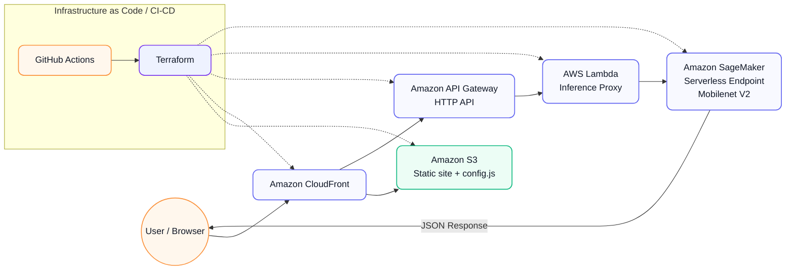

# 🧠 SageMaker Serverless Demo (Mobilenet V2)


---

## 📋 Overview

A minimal end-to-end **serverless image classification** demo using AWS services.  
The project serves a simple web interface via **S3 + CloudFront** that connects through an **API Gateway** and **Lambda proxy** to an **Amazon SageMaker Serverless Endpoint** running **Mobilenet V2** for image recognition.

---

## 🏗️ Architecture (high-level)



---

## ✨ Features

- **Serverless** architecture — zero idle cost  
- **Terraform** end-to-end provisioning  
- **SageMaker Serverless Endpoint** for ML inference  
- **API Gateway + Lambda** integration layer  
- **S3 + CloudFront** for static web hosting  
- Simple and cost-efficient ML deployment demo  

---

## 🚀 Deployment

**Requirements**
- AWS CLI configured  
- Terraform ≥ 1.5 installed  
- Pre-trained model archive: `infra/model.tar.gz`  

```bash
cd infra
terraform init
terraform apply -auto-approve
```

The comments for the commands above are intentionally placed below the block per your style preference.

---

## 💰 Cost Optimization

| Service | Optimization | Description |
|----------|---------------|-------------|
| **SageMaker** | Serverless Endpoint | Pay only for invocation time |
| **Lambda** | On-demand execution | Auto-scales, no idle time |
| **CloudFront** | CDN caching | Reduces S3 reads & latency |
| **S3** | Static website | Low-cost storage for assets |
| **API Gateway** | HTTP API | Cheaper than REST API |
| **Terraform** | Easy teardown | Run destroy to stop charges |

---

## 📂 Folder Structure

```
ml-sagemaker-serverless/
├── frontend/
│   ├── index.html
│   ├── out.json
│   ├── script.js
│   ├── style.css
│   └── thomas.png
├── infra/
│   ├── api_and_config.tf
│   ├── existing.tf
│   ├── iam_lambda_invoke.tf
│   ├── minimal.auto.tfvars
│   ├── model.tar.gz
│   ├── outputs.tf
│   ├── providers.tf
│   ├── sagemaker_deploy.tf
│   ├── terraform.tfstate
│   ├── terraform.tfstate.backup
│   └── variables.tf
├── mobilenet_sls/
│   └── code/
│       ├── inference.py
│       └── requirements.txt
├── scripts/
│   └── inference_proxy.py
└── terraform.tfstate
```

---

## 🧹 Cleanup

```bash
cd infra
terraform destroy -auto-approve
```

The comment for the command above is intentionally placed below the block.

---

## 🪪 License

MIT — use freely for demos and learning.

---

> This project demonstrates a production-ready **serverless ML inference pipeline** using modern AWS services and Terraform.
