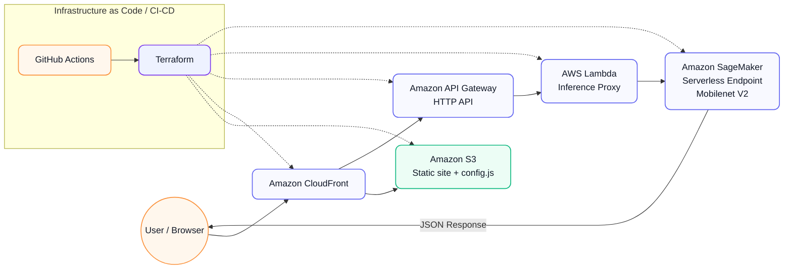

# 🧠 SageMaker Serverless Demo (Mobilenet V2)


---

### 🌐 Live Demo
- **Website:** [https://ml-demo.store/](https://ml-demo.store/)
- **API Endpoint:** [`/predict`](https://222izyufsl.execute-api.us-east-1.amazonaws.com/predict)
- **Model:** Mobilenet V2 (Image Classification)

---

## 📋 Overview

This project demonstrates an **end-to-end serverless image classification pipeline** on AWS.  
It uses **Amazon SageMaker Serverless Inference** to host the pre-trained **Mobilenet V2** model, integrated with **API Gateway**, **Lambda**, and a **static web UI** deployed via **S3 + CloudFront** — all provisioned automatically with **Terraform**.

The goal is to show how to deploy a **production-ready ML inference system** that’s fast, scalable, and cost-efficient — perfect for portfolios, demos, or internal proof-of-concept setups.

<p align="center">
  
</p>

---

## 🏗️ Architecture (high-level)



---

## ⚙️ How It Works

1️⃣ **User** opens the static web UI (`index.html` + `script.js`) served via **CloudFront + S3**.  
2️⃣ `config.js` contains the API URL (no-cache headers).  
3️⃣ The browser sends an image URL to `POST /predict` on **API Gateway**.  
4️⃣ **Lambda (inference proxy)** receives the request and invokes the **SageMaker Serverless Endpoint**.  
5️⃣ **SageMaker** runs inference using the **Mobilenet V2** model.  
6️⃣ The **predicted class and probability** are returned as a JSON response to the UI.

---

## 🚀 Deployment (Terraform)

**Prerequisites**
- AWS CLI configured
- Terraform ≥ 1.5
- A pre-trained `model.tar.gz` (Mobilenet V2) in the `infra/` directory

```bash
cd infra
terraform init
terraform apply -auto-approve
```

The comments for the commands above are intentionally placed below the block per your style preference.

Terraform provisions:
- IAM roles for Lambda and SageMaker  
- S3 bucket + CloudFront distribution  
- API Gateway (HTTP API) and Lambda integration  
- SageMaker model + endpoint (serverless)  
- Uploads `config.js` and invalidates CloudFront cache

---

## 💰 Cost Optimization

| Service | Optimization | Description |
|----------|---------------|-------------|
| **SageMaker** | Serverless Endpoint | Pay only for invocation time |
| **Lambda** | On-demand | Scales automatically with traffic |
| **CloudFront** | CDN caching | Reduces S3 GETs and latency |
| **S3** | Static site | Extremely low-cost hosting |
| **API Gateway** | HTTP API | Cheaper and faster than REST |
| **Terraform** | Destroy when idle | Clean teardown stops billing |

💡 *Tip:* Ideal for demos or learning — infrastructure can be fully destroyed with one command when not in use.

---

## 🔮 Future Improvements

- Automated **CI/CD** via GitHub Actions (plan/apply workflows)  
- **Cognito** authentication for `/predict` requests  
- **CloudWatch dashboards** for real-time metrics  
- **Multi-model endpoint** deployment pattern  
- Optional **SVG diagram** for ultra-sharp zoom in docs

---

## 🧰 Tech Stack

| Category | Technology |
|-----------|-------------|
| **Infrastructure** | AWS (SageMaker, Lambda, API Gateway, S3, CloudFront, IAM) |
| **IaC** | Terraform |
| **CI/CD** | GitHub Actions |
| **Language** | Python 3.10 (Lambda + inference) |
| **Frontend** | HTML, CSS, JavaScript |
| **Model** | Mobilenet V2 (Image classification) |

---

## 📂 Folder Structure

```
ml-sagemaker-serverless/
├── frontend/
│   ├── index.html
│   ├── out.json
│   ├── script.js
│   ├── style.css
│   └── thomas.png
├── infra/
│   ├── api_and_config.tf
│   ├── existing.tf
│   ├── iam_lambda_invoke.tf
│   ├── minimal.auto.tfvars
│   ├── model.tar.gz
│   ├── outputs.tf
│   ├── providers.tf
│   ├── sagemaker_deploy.tf
│   ├── terraform.tfstate
│   ├── terraform.tfstate.backup
│   └── variables.tf
├── mobilenet_sls/
│   └── code/
│       ├── inference.py
│       └── requirements.txt
├── scripts/
│   └── inference_proxy.py
└── terraform.tfstate
```

---

## 🧹 Cleanup

```bash
cd infra
terraform destroy -auto-approve
```

The comment for the command above is intentionally placed below the block per your style preference.

---

## 🪪 License

MIT — Free to use, modify, and deploy for demos, learning, or portfolio purposes.

---

> 💡 **Project purpose:** Showcase how to deploy a real ML model using AWS Serverless architecture with Terraform automation.  
> Ideal for DevOps and Cloud Engineer portfolios.
