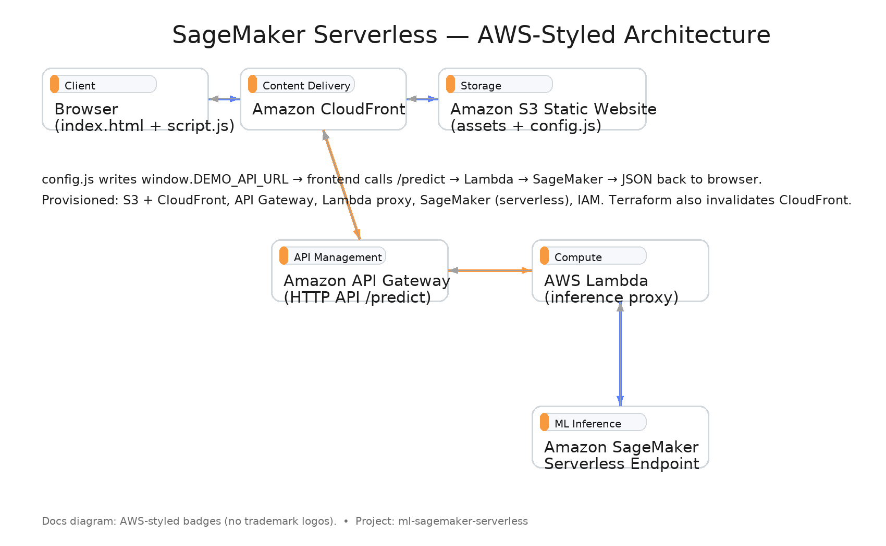

# SageMaker Serverless Demo (Mobilenet V2)

A minimal end‑to‑end demo that serves image classification via an **Amazon SageMaker Serverless Endpoint**, fronted by **API Gateway + Lambda** and a **static web UI on S3 + CloudFront**.



---

## Live endpoints (from the latest `terraform apply`)

- **Demo site:** `https://ml-demo.store`
- **API URL:** `https://222izyufsl.execute-api.us-east-1.amazonaws.com/predict`
- **Endpoint name:** `mobilenet-v2-sls`

> These values are auto‑wired into `config.js` during deploy.

---

## Architecture (High level)

- **S3 + CloudFront** host the static UI (`index.html`, `script.js`, `style.css`). A small `config.js` file contains `window.DEMO_API_URL` and is uploaded with `no-cache` headers.
- **API Gateway (HTTP)** exposes `POST /predict`.
- **Lambda (inference proxy)** receives browser requests and forwards payloads to **SageMaker**.
- **SageMaker Serverless Endpoint** loads the **Mobilenet V2** model and returns predictions.
- **Terraform** provisions the stack and writes `config.js`, then invalidates CloudFront.

<p align="center">
  
</p>

---

## Repo structure

```
ml-sagemaker-serverless/
├── frontend/                 # Static site
│   ├── index.html
│   ├── script.js
│   └── style.css
├── infra/                    # Terraform IaC (API Gateway, Lambda, S3, CF, SageMaker, IAM)
│   ├── providers.tf
│   ├── variables.tf
│   ├── sagemaker_deploy.tf
│   ├── api_and_config.tf
│   ├── iam_lambda_invoke.tf
│   ├── outputs.tf
│   └── minimal.auto.tfvars
├── mobilenet_sls/
│   └── code/
│       ├── inference.py
│       └── requirements.txt
└── scripts/
    └── inference_proxy.py
```

---

## Quick start (from a clean workstation)

```
# 1) Initialize and apply Terraform
cd infra
terraform init
terraform apply -auto-approve

# 2) Open the demo UI
#    After apply, CloudFront + S3 serve the site and config.js points to the API.
```

The comments for the commands above are placed here intentionally to follow your style preference.

---

## Invoke the API directly (without frontend)

```
curl -sS -X POST   -H "Content-Type: application/json"   -d '{"image_url":"https://example.com/cat.jpg"}'   https://222izyufsl.execute-api.us-east-1.amazonaws.com/predict
```

The comment for the command above is placed here intentionally to follow your style preference.

---

## Cost profile

- **SageMaker Serverless**: pay‑per‑invocation (no instance running while idle).
- **Lambda + API Gateway**: request‑driven.
- **S3 + CloudFront**: minimal for a tiny static site; CloudFront helps reduce S3 GET costs at scale.
- **Tip**: Keep large test images outside the repo; use presigned URLs or small assets for demos.

---

## Clean up

```
cd infra
terraform destroy -auto-approve
```

The comment for the commands above is placed here intentionally to follow your style preference.

---

## RU: Кратко по‑русски

- **UI** на S3 + CloudFront (статический сайт). `config.js` с `DEMO_API_URL` загружается с `no-cache` и инвалидацией CloudFront.
- **/predict** через API Gateway (HTTP) → **Lambda** (proxy) → **SageMaker Serverless Endpoint** (модель **Mobilenet V2**).
- **Terraform** создает ресурсы и публикует `config.js`, после чего фронт сразу готов.

**Быстрый старт**

```
cd infra
terraform init
terraform apply -auto-approve
```

Комментарии к командам специально вынесены ниже блока.

---

### Notes

- Keep secrets in proper stores; this demo has no secrets beyond public URLs.
- For real apps consider auth (Cognito, OAuth), request validation, monitoring (CloudWatch), and CI/CD.

---

## 📘 Docs

- [Architecture Diagram](./docs/sagemaker-serverless-architecture.png)
