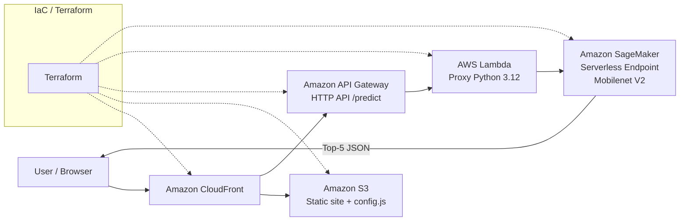
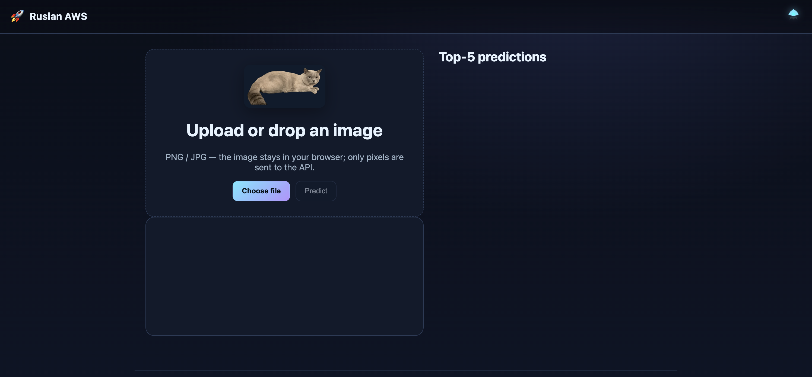
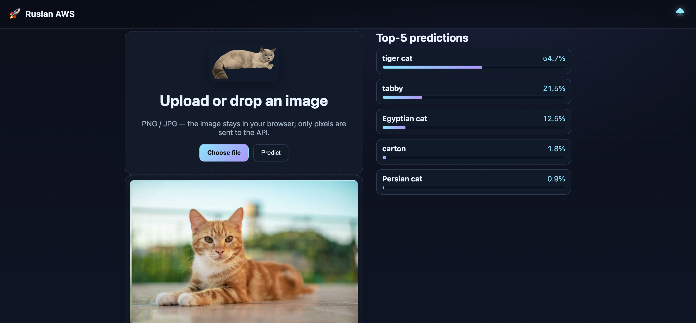
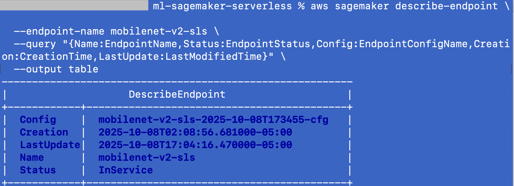
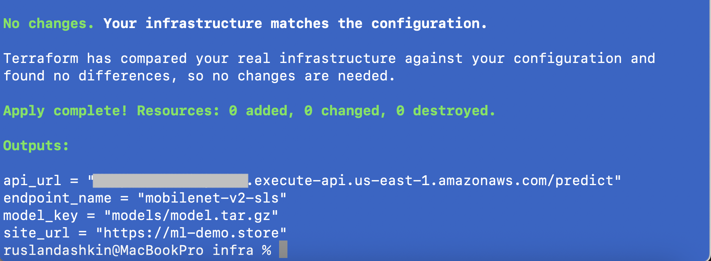

# SageMaker Serverless Demo Mobilenet V2 (End‑to‑End Production Stack)

<p align="center">
  
  
  
  
  
  
  
  
  
  
  
  <br/><br/>
  
  
  
  
  
  
</p>

---

## **Live Demo:** [https://ml-demo.store](https://ml-demo.store)

A fully automated, production-grade **serverless ML application** running on AWS.  
It performs **image classification** with **Mobilenet V2 (ImageNet)** deployed on  
**SageMaker Serverless Inference**, exposed via **API Gateway + Lambda**,  
and delivered globally through **CloudFront + S3** — all provisioned with **Terraform**.

Key capabilities:

- **End-to-end Serverless Image Classification on AWS** - fully automated, fast, and production-ready.
- **True serverless ML inference** — no EC2, no containers to manage  
- **Clean full-pipeline flow:** browser → API → Lambda → SageMaker  
- **Strong security posture:** least-privilege IAM, encrypted state, scoped permissions  
- **Deterministic IaC:** reproducible deploys, remote state, DynamoDB locking  
- **Optimized performance:** low latency, CDN caching, lightweight frontend

---

## **Architecture Overview**


``` mermaid
flowchart LR
  U["User / Browser"] --> CF["Amazon CloudFront"]
  CF --> S3["Amazon S3<br/>Static site + config.js"]
  CF --> APIGW["Amazon API Gateway<br/>HTTP API /predict"]
  APIGW --> LBD["AWS Lambda<br/>Proxy Python 3.12"]
  LBD --> SM["Amazon SageMaker<br/>Serverless Endpoint<br/>Mobilenet V2"]
  SM -->|"Top-5 JSON"| U

  subgraph IaC_Terraform [IaC / Terraform]
    TF["Terraform"]
  end
  TF -.-> CF
  TF -.-> S3
  TF -.-> APIGW
  TF -.-> LBD
  TF -.-> SM
```

---

## **Prerequisites**

- **AWS CLI** installed and configured  
- **Terraform ≥ 1.6**  
- **AWS Provider ≥ 5.50**  
- **Python 3.10+** (for local inference utilities)  
- **GitHub Actions OIDC role** created (for CI/CD)  
- Existing:  
  - **S3 bucket** for static site  
  - **CloudFront distribution**  
  - **API Gateway HTTP API**  
  - **S3 model artifacts bucket**  
- Recommended local tools:  
  - `tflint`  
  - `tfsec`  
  - `checkov`  

## ⚙️ Components

### **Frontend (S3 + CloudFront)**

-   Static web UI (HTML/CSS/JS)\
-   Drag-and-drop uploader\
-   `config.js` regenerated by Terraform\
-   CloudFront invalidation only where needed

### **API (API Gateway HTTP API)**

-   Simpler & cheaper than REST API\
-   Single route → `POST /predict`\
-   CORS enabled

### **Lambda Proxy (Python 3.12)**

-   Thin orchestrator\
-   Decodes body (Base64), forwards to SageMaker Runtime\
-   Handles CORS & JSON marshalling\
-   Minimal latency design

### **SageMaker Serverless Endpoint**

-   Mobilenet V2, ImageNet pre-trained\
-   CPU, low-cost, pay-per-request\
-   Automatically scales\
-   2048 MB memory / concurrency 1 (tunable)

### **Terraform IaC**

-   Complete end‑to‑end provisioning\
-   Remote state (S3 + DynamoDB locks)\
-   Role wiring, permissions, CloudFront invalidations\
-   Null resources orchestrate SageMaker lifecycle

---

## **Quick Start**

### **Local Terraform Deployment**
```bash
cd infra

terraform init
terraform plan -out=tfplan
terraform apply -auto-approve tfplan
```

---

### **CI/CD Deployment (Recommended)**

- Fully automated deployment pipeline using GitHub Actions  
- Secure authentication via OIDC role (no long-lived AWS keys)  
- Automatic linting and security checks for Terraform (fmt, validate, tflint, tfsec, checkov)  
- Infrastructure changes are planned and applied through pull requests  
- Destroy workflow available for clean environment teardown  
- Ensures consistent, reproducible, and auditable deployments  

---

## **Key AWS Services Used**

| Service                    | Purpose                                                                  |
|----------------------------|--------------------------------------------------------------------------|
| **Amazon SageMaker**       | Serverless inference (Mobilenet V2)                                      |
| **AWS Lambda**             | Proxy layer for invoking the SageMaker endpoint                          |
| **API Gateway (HTTP API)** | Lightweight public API for `/predict`                                    |
| **Amazon S3**              | Static frontend hosting + storage for model artifacts                    |
| **S3 SSE-S3 (AES-256)**    | Server-side encryption for Terraform remote state                        |
| **Amazon CloudFront**      | Global CDN for serving UI with caching + invalidations                   |
| **AWS IAM**                | Least-privilege access for Lambda, SageMaker, API Gateway                |
| **GitHub Actions**         | CI/CD pipelines: fmt, validate, tflint, tfsec, checkov, deploy/destroy   |
| **Terraform**              | Full IaC provisioning of all AWS resources                               |

---

## **Default Timings (Current Configuration)**

- **Lambda proxy timeout:** 30 seconds  
- **Lambda proxy memory:** 512 MB  
- **SageMaker serverless memory:** 2048 MB  
- **SageMaker max concurrency:** 1 concurrent request  

---

## **Application Layer**

- **Frontend (S3 + CloudFront)** — static HTML/CSS/JS UI with drag-and-drop upload, config.js API injection, and CloudFront caching.
- **API Gateway (HTTP API)** — lightweight public entrypoint for `/predict` with automatic CORS.
- **Lambda Proxy (Python 3.12)** — forwards request body directly to SageMaker Runtime, returns JSON response.
- **SageMaker Serverless Endpoint** — Mobilenet V2 inference, ImageNet preprocessing, CPU-optimized serverless scaling.

---

## **Project Structure**
```text

ml-sagemaker-serverless/
├── frontend/              # Static UI (HTML, CSS, JS)
├── infra/                 # Terraform — full IaC stack
├── mobilenet_sls/         # SageMaker inference code (PyTorch)
├── scripts/               # Lambda proxy script
├── docs/                  # Architecture, ADRs, runbooks, diagrams
├── .github/               # Workflows + issue/PR templates
├── LICENSE                # MIT license
└── README.md              # Main project documentation

```

**Full detailed structure:** see [`docs/architecture.md`](./docs/architecture.md)

---

## **Documentation**

All production-grade documentation for this project is located in the `docs/` directory.  
It covers architecture, decisions, operations, troubleshooting, cost, and security — everything a reviewer or interviewer needs.

---

### **Architecture**
- **High-Level Architecture** — [`docs/architecture.md`](./docs/architecture.md)
- **System Diagrams**
  - Architecture (high-level) — [`docs/diagrams/architecture-high-level.md`](./docs/diagrams/architecture-high-level.md)
  - CI/CD OIDC Workflow — [`docs/diagrams/ci-cd-oidc-workflow.md`](./docs/diagrams/ci-cd-oidc-workflow.md)
  - Inference Data Flow — [`docs/diagrams/inference-data-flow.md`](./docs/diagrams/inference-data-flow.md)

---

### **ADR — Architecture Decision Records**
- **ADR-001—Serverless vs Realtime**  
  [`docs/adr/ADR-001 — Serverless vs Realtime.md`](./docs/adr/ADR-001%20—%20Serverless%20vs%20Realtime.md)

- **ADR-002—Lambda Proxy Choice**  
  [`docs/adr/ADR-002 — Lambda Proxy Choice.md`](./docs/adr/ADR-002%20—%20Lambda%20Proxy%20Choice.md)

- **ADR-003—CloudFront + S3 as Static Layer**  
  [`docs/adr/ADR-003 — CloudFront + S3.md`](./docs/adr/ADR-003%20—%20CloudFront%20+%20S3.md)

- **ADR-004—Terraform Null-Resource vs Native SM Resources**  
  [`docs/adr/ADR-004 — Terraform Null vs Native.md`](./docs/adr/ADR-004%20—%20Terraform%20Null%20vs%20Native.md)

- **ADR-005—Mobilenet V2 Model Choice**  
  [`docs/adr/ADR-005 — Mobilenet V2 Choice.md`](./docs/adr/ADR-005%20—%20Mobilenet%20V2%20Choice.md)

---

### **Runbooks**
- **Wake Failure (API → Lambda → SageMaker)**  
  [`docs/runbooks/wake-failure.md`](./docs/runbooks/wake-failure.md)

- **Destroy Not Triggered (Terraform pipelines)**  
  [`docs/runbooks/destroy-not-triggered.md`](./docs/runbooks/destroy-not-triggered.md)

- **Rollback Procedure (Endpoint / Config / Model)**  
  [`docs/runbooks/rollback.md`](./docs/runbooks/rollback.md)

---

### **Monitoring & SLO**
- **Monitoring Strategy** — [`docs/monitoring.md`](./docs/monitoring.md)  
- **Service Level Objectives (SLO/SLI)** — [`docs/slo.md`](./docs/slo.md)

---

### **Cost & Governance**
- **Cost Model & Optimization** — [`docs/cost.md`](./docs/cost.md)  
- **Deployment Strategies** — [`docs/deployment-strategies.md`](./docs/deployment-strategies.md)  
- **Threat Model / Security Review** — [`docs/threat-model.md`](./docs/threat-model.md)
- **Interview Prep Notes:** [`docs/interview.md`](./docs/interview.md)
- **Security Overview** — [`docs/security.md`](./docs/security.md)

---

## **Cost Optimization Principles**

- Serverless pay-per-request: no idle compute.  
- Right-sized SageMaker Serverless (CPU-only, tuned memory/concurrency).  
- HTTP API instead of REST for lower cost and latency.  
- Minimal Lambda logic → smaller cold starts and cheaper execution.  
- CloudFront caching & targeted invalidations reduce S3/API traffic.  
- S3 for static hosting = negligible cost.  
- Terraform remote state on S3 + DynamoDB = lowest-maintenance backend.

---

## **Terraform CI**

### **Overview**
- CI runs on every PR touching `infra/**` or CI configs.  
- Ensures formatting, validation, linting, and security checks are clean before deploy.

### **Tested Versions**
- Terraform: **1.6.6**, **1.8.5**, **1.9.0**.

### **Checks**
- `terraform fmt`  
- `terraform init -backend=false` + `validate`  
- `tflint`  
- `tfsec`  
- `checkov`

### **Failure Behavior**
- Any failed check blocks merge.
- Deployment workflows do not run until CI is green.

---

## **Rollout & Rollback Strategy**

### **Rollout**
- Terraform builds a timestamped Model + EndpointConfig.
- Endpoint is updated in-place and Terraform waits for **InService**.
- `config.js` is regenerated and CloudFront invalidates only changed paths.

### **Rollback**
- Previous Models and EndpointConfigs are kept (timestamped).
- Rollback = switch Endpoint to a known-good config or re-apply an older commit.
- CloudFront invalidates minimal files for immediate UI sync.

### **Safety**
- Deploy completes only when SageMaker reports **InService**.
- Old versions stay available for instant rollback.
- No breaking API changes (stable JSON contract).

---

## **Production Scaling Plan**

### **High Availability**
- All core components (API Gateway, Lambda, SageMaker Serverless, S3, CloudFront) are multi-AZ by default.
- No single point of failure; static UI remains globally accessible via CloudFront even during partial outages.

### **Disaster Recovery**
- Model artifacts can be replicated via S3 CRR.
- Full regional failover = update region + replicate artifacts + re-apply Terraform.

### **Capacity Planning**
- Tune SageMaker Serverless: `MemorySizeInMB` + `MaxConcurrency`.
- API Gateway, Lambda, and CloudFront auto-scale without manual configuration.

### **Security Hardening**
- Narrower IAM permissions, optional WAF, CloudFront OAC.
- Stronger S3 public-access controls for frontend hosting.

### **Network Segmentation (Future)**
- Move Lambda + SageMaker into private subnets.
- Add VPC Endpoints for API Gateway → Lambda → SageMaker.

---

### **Why This Matters for This Project**

For an ML system combining API Gateway → Lambda → SageMaker Serverless → CloudFront,
a single misconfigured IAM policy, missing endpoint permission, or invalid TF syntax can break:

- model deployment  
- endpoint updates  
- Lambda → SageMaker invocation flow  
- CloudFront config generation  

CI ensures deterministic, secure, and production-grade infrastructure updates every time.

---

#  Why This Project Is Valuable for Interviews

### **1. Demonstrates real production-level architecture**

This is a complete end-to-end ML service with clean separation between the frontend, API layer, and inference logic.
It shows that you can design and operate a genuine cloud-native system — not just run experiments inside SageMaker notebooks.

### **2. Shows strong AWS integration skills**

CloudFront → S3 → API Gateway → Lambda → SageMaker → IAM → Terraform.
Correctly wiring these services together is non-trivial, and this project demonstrates practical understanding of how AWS components interact in real environments.

### **3. Modern serverless ML design**

It uses a fully serverless, low-maintenance, pay-per-request architecture.
This is exactly how companies deploy lightweight ML models in real production systems today.

### **4. Strong Infrastructure-as-Code discipline**

Everything is reproducible.
No manual AWS clicks.
Remote state + DynamoDB locking.
Clear resource dependencies and predictable deploys.
This signals reliability and readiness for team-scale infrastructure work.

### **5. Reflects real engineering problem-solving**

Cold starts
CORS behavior
CloudFront caching
IAM permission failures
SageMaker endpoint update states
—all of these are real industry problems, and the project shows that you can diagnose and solve them correctly.

### **6. Signals full-stack ownership**

You built the UI, backend API, ML runtime, CI/CD, Terraform infrastructure, IAM boundaries, and the overall system design.
This demonstrates the ability to take responsibility for an entire vertical slice of a production application.

### **7. Creates strong opportunities for technical discussion**

This project naturally invites conversations about latency, scaling characteristics, caching strategies, cost optimization, observability, and architectural trade-offs — all topics interviewers use to assess engineering depth.

---

## **Future Improvements (Interview-Oriented)**

- **Observability:** unified logs/metrics/traces, JSON logging, latency + cold-start metrics.  
- **SLO-Based Alerts:** API 5xx, Lambda errors/throttles, SageMaker failures, CloudFront origin errors.  
- **Multi-Env Setup:** separate Prod/Staging/Sandbox accounts, OIDC-based cross-account deploys.  
- **Drift Detection:** scheduled `terraform plan` and automated drift reports in CI.  
- **Zero-Downtime Deploys:** staged rollout for SageMaker (new config → gradual traffic shift → quick rollback).  
- **Security Hardening:** tighter IAM, optional WAF, automated secret scanning.  
- **Operational Maturity:** versioned model registry, consistent tagging, cost anomaly alerts.

---

#  FAQ

### **Why SageMaker Serverless instead of Lambda-only inference?**

Faster, cheaper, supports large models, avoids timeouts.

### **Why keep Lambda at all?**

To decouple API Gateway from ML layer and manage CORS/security cleanly.

### **Why Mobilenet?**

Lightweight, ImageNet, perfect for demos.\
You can drop in any PyTorch model instead.

### **Why timestamp configs/models?**

Prevent conflicts, allow rollbacks, ensure deterministic updates.

### **Is this production-ready?**

Yes --- with CI/CD, alarms, auth, and private endpoints it becomes a
full production footprint.

---

##  Screenshots

Below are a few focused screenshots illustrating the core parts of the project.

---
### **UI — Initial State (Before Upload)**

Landing view of the frontend before selecting or dropping an image.



---

### **UI — Prediction Result**

Shows the full end-to-end workflow:  
Image uploaded → API Gateway → Lambda proxy → SageMaker Serverless → Top-5 predictions.



---

### **SageMaker Endpoint — InService (CLI)**

Demonstrates that the SageMaker Serverless endpoint is healthy and serving traffic.  
All sensitive values are redacted.



---

### **Terraform — Successful Apply**

Shows that the entire infrastructure is synchronized and no drift is detected.  
API URLs and IDs are masked so the screenshot is safe to publish.



---

# **Summary**

This project delivers a complete, production-style serverless ML pipeline on AWS.  
It demonstrates strong cloud engineering skills, IaC discipline, and real care for  
security, scalability, cost efficiency, and operational clarity.

### **Key highlights**
- End-to-end serverless architecture (CloudFront → S3 → API Gateway → Lambda → SageMaker)  
- Fully automated deployments using Terraform and GitHub Actions OIDC  
- Clean separation of frontend, API, and inference workloads  
- Realistic operational practices: caching, permissions, state locking, invalidations  
- Thoughtful documentation: ADRs, runbooks, diagrams, monitoring, SLO, threat model  


---

## **Author & Portfolio**

Portfolio website: https://rusets.com  
More real AWS, DevOps, IaC, and automation projects by **Ruslan AWS**.

---

## License

Released under the MIT License.  
See the LICENSE file for full details.

Branding name “🚀 Ruslan AWS” and related visuals may not be reused or rebranded without permission.