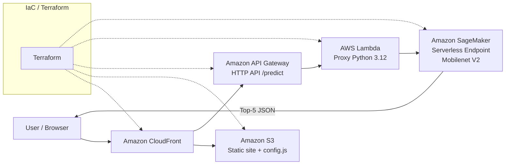

# SageMaker Serverless ML Inference Platform

<p align="center">
  
  
  
  
  
</p>

**Live Platform:** [https://ml-demo.store](https://ml-demo.store)

I built a production-grade, serverless ML inference platform on AWS.

The system performs image classification using Mobilenet V2 (ImageNet)
deployed on SageMaker Serverless Inference, exposed via API Gateway and Lambda,
and delivered globally through CloudFront and S3 — all provisioned with Terraform.

## What I Implemented

- Production-ready serverless ML inference architecture on AWS
- Deterministic Infrastructure-as-Code with Terraform and remote state locking
- Strict IAM boundaries and secure cross-service integration
- Fully automated CI/CD with OIDC-based role assumption
- Controlled deployment strategy with versioned endpoints and safe rollback

---

## **Architecture Overview**


``` mermaid
flowchart LR
  U["User / Browser"] --> CF["Amazon CloudFront"]
  CF --> S3["Amazon S3<br/>Static site + config.js"]
  CF --> APIGW["Amazon API Gateway<br/>HTTP API /predict"]
  APIGW --> LBD["AWS Lambda<br/>Proxy Python 3.12"]
  LBD --> SM["Amazon SageMaker<br/>Serverless Endpoint<br/>Mobilenet V2"]
  SM -->|"Top-5 JSON"| U

  subgraph IaC_Terraform [IaC / Terraform]
    TF["Terraform"]
  end
  TF -.-> CF
  TF -.-> S3
  TF -.-> APIGW
  TF -.-> LBD
  TF -.-> SM
```

---
 
## Components

### Frontend — S3 + CloudFront
- Static web UI (HTML/CSS/JS)
- Drag-and-drop image upload
- API endpoint injected via Terraform-generated `config.js`
- CDN caching with targeted invalidations

### API — API Gateway (HTTP API)
- Public `POST /predict` endpoint
- CORS configuration
- Lightweight HTTP API (lower cost and latency vs REST API)

### Lambda Proxy — Python 3.12
- Base64 payload decoding
- Invocation of SageMaker Runtime
- Response normalization and error handling

### SageMaker Serverless Endpoint
- Mobilenet V2 (ImageNet)
- Serverless CPU inference
- Configurable memory and concurrency

### Infrastructure — Terraform
- End-to-end resource provisioning
- Remote state (S3 + DynamoDB locking)
- IAM role wiring and scoped permissions

---

## **Quick Start**

### **Local Terraform Deployment**
```bash
cd infra

terraform init
terraform plan -out=tfplan
terraform apply -auto-approve tfplan
```

---

### CI/CD Deployment

- Automated pipelines with GitHub Actions
- OIDC-based authentication (no static AWS credentials)
- Terraform quality gates: `fmt`, `validate`, `tflint`, `tfsec`, `checkov`
- `plan` on pull requests, `apply` on main
- Dedicated destroy workflow
- Deterministic and auditable infrastructure changes

---

## Key AWS Services Used

| Service | Purpose |
|---------|---------|
| Amazon SageMaker (Serverless) | Image classification inference (Mobilenet V2) |
| AWS Lambda | Proxy layer between API Gateway and SageMaker |
| Amazon API Gateway (HTTP API) | Public `/predict` endpoint |
| Amazon S3 + CloudFront | Static frontend hosting, CDN delivery, caching |
| AWS IAM | Least-privilege access control |
| Amazon S3 + DynamoDB | Terraform remote state + state locking |
| GitHub Actions (OIDC) | CI/CD pipelines and secure role assumption |
| Terraform | Infrastructure provisioning and orchestration |

---

## Runtime Configuration

Current production configuration:

- Lambda timeout: 30 seconds
- Lambda memory: 512 MB
- SageMaker Serverless memory: 2048 MB
- SageMaker max concurrency: 1 

---

## **Project Structure**

```text
ml-sagemaker-serverless/
├── frontend/              # Static UI (HTML, CSS, JS)
├── infra/                 # Terraform — full IaC stack
├── mobilenet_sls/         # SageMaker inference code (PyTorch)
├── scripts/               # Lambda proxy script
├── docs/                  # Architecture, ADRs, runbooks, diagrams
├── .github/               # Workflows + issue/PR templates
├── LICENSE                # MIT license
└── README.md              # Main project documentation
```

**Full detailed structure:** see [`docs/architecture.md`](./docs/architecture.md)

---

## Documentation

**Detailed Docs:** [Architecture](./docs/architecture.md) | [ADRs](./docs/adr/) | [Runbooks](./docs/runbooks/) | [Monitoring & SLO](./docs/monitoring.md)

---

## Cost Strategy

- Fully serverless architecture — no idle infrastructure
- Right-sized SageMaker Serverless (CPU, tuned memory and concurrency)
- HTTP API instead of REST API to reduce cost and latency
- Minimal Lambda logic to lower execution time
- CloudFront caching to reduce origin load
- S3 static hosting for near-zero frontend cost
- S3 + DynamoDB remote state for low-maintenance IaC backend

---

## Deployment & Rollback Strategy

### Deployment
- Terraform creates versioned Model and EndpointConfig
- Endpoint updated in place and waits for `InService`
- Frontend config regenerated and CloudFront selectively invalidated

### Rollback
- Previous Models and EndpointConfigs retained
- Rollback via config switch or re-applying a previous commit
- No API contract changes

### Safety Controls
- Deployment completes only after SageMaker health confirmation
- Versioned resources enable fast recovery

---

## Scaling & Reliability Considerations

- All core services are multi-AZ by design (API Gateway, Lambda, SageMaker Serverless, S3, CloudFront)
- SageMaker scaling controlled via `MemorySizeInMB` and `MaxConcurrency`
- API Gateway, Lambda, and CloudFront scale automatically
- Model artifacts can be replicated using S3 Cross-Region Replication if needed
- Architecture supports regional redeployment via Terraform

---


## Future Improvements

- Centralized observability (structured logging, metrics, tracing)
- Alerting aligned with SLOs (API errors, Lambda failures, endpoint health)
- Multi-environment setup (separate AWS accounts with OIDC-based deploys)
- Automated drift detection in CI
- Blue/Green or staged SageMaker endpoint rollout
- Additional security layers (WAF, stricter IAM boundaries, automated secret scanning)

---

## FAQ

### Why SageMaker Serverless instead of Lambda-only inference?

SageMaker Serverless supports larger models, avoids Lambda timeout limitations, and provides better scaling characteristics for ML workloads.

### Why keep Lambda in the architecture?

Lambda acts as a controlled abstraction layer between API Gateway and SageMaker.  
It handles CORS, request validation, response shaping, and isolates the ML layer behind scoped IAM permissions.

### Why Mobilenet V2?

Mobilenet V2 is lightweight, fast, and widely recognized.  
It is well-suited for serverless inference due to its small footprint and low latency while maintaining strong ImageNet performance.

### How are cold starts handled?

SageMaker Serverless may introduce cold start latency when scaling from zero.  
This setup minimizes impact by keeping Lambda lightweight and allowing memory and concurrency tuning. Provisioned capacity can be enabled if stricter latency requirements are needed.

### Why timestamp model and endpoint configurations?

Timestamping enables deterministic deployments, avoids naming conflicts, and simplifies rollbacks.

### Is this production-ready?

Yes. The architecture supports production deployment with CI/CD, scoped IAM policies, and controlled rollout and rollback workflows.

---

##  Screenshots

Below are a few focused screenshots illustrating the core parts of the project.

---
### **UI — Initial State (Before Upload)**

Landing view of the frontend before selecting or dropping an image.


---

### **UI — Prediction Result**

Shows the full end-to-end workflow:  
Image uploaded → API Gateway → Lambda proxy → SageMaker Serverless → Top-5 predictions.


---

### **SageMaker Endpoint — InService (CLI)**

Demonstrates that the SageMaker Serverless endpoint is healthy and serving traffic.  
All sensitive values are redacted.


---

### **Terraform — Successful Apply**

Shows that the entire infrastructure is synchronized and no drift is detected.  
API URLs and IDs are masked so the screenshot is safe to publish.


---

## License

This project is released under the MIT License.

See the `LICENSE` file for details.