# 🚀 docker-ecs-deployment

Spin up a **zero-cost-at-idle** demo app on **AWS ECS Fargate** without an ALB.  
Traffic goes to a **public task IP**, the service **auto-sleeps to 0**, and a small **“wake”** Lambda behind **API Gateway** starts it on demand. Domain: **https://ecs-demo.online**.

---

## 📦 What you get

- **Node.js demo app** (Express) with a slick UI (dark/light), live logs (SSE), and simple actions.
- **ECR** repository to store your images.
- **VPC** with two public subnets, **security group**, **ECS cluster**, **Fargate service**.
- **Wake API**: API Gateway → Lambda (Python) that scales the service to **1** and redirects to the task IP.
- **Auto-sleep**: EventBridge rule → Lambda (Python) that scales the service to **0** after inactivity.
- **GitHub Actions** (3 workflows):
  - **CI**: Build & push to ECR.
  - **CD**: Terraform apply / destroy and roll service to a new image.
  - **OPS**: Wake or Sleep the service on demand.

> ✅ **Minimal state**: All Terraform is in `infra/main.tf` (no split files).

---

## 🧭 Repository structure

```text
.
├── app/
│   ├── Dockerfile
│   └── src/
│       └── server.js
├── autosleep/
│   └── auto_sleep.py                   # Lambda: auto-stop service after N minutes
├── wake/
│   └── lambda_function.py              # Lambda: scale-to-1 + redirect to task IP
├── infra/
│   └── main.tf                         # All Terraform in a single file
├── .github/workflows/
│   ├── ci.yml                          # CI — Build & Push to ECR
│   ├── cd.yml                          # CD — Terraform Apply + Deploy/Destroy (ECS)
│   └── ops.yml                         # OPS — Wake/Sleep ECS Service helpers
└── make_zips.sh                        # Creates Lambda bundles: infra/wake.zip & infra/sleep.zip
```

> If you only keep **`infra/main.tf`**, that’s fine — this repo is designed to work with just one TF file.

---

## 🏗️ Architecture (high-level)

```mermaid
flowchart LR
  subgraph GH[GitHub]
    CI[CI • Build & Push to ECR<br/>ci.yml]
    CD[CD • Terraform Apply & Deploy<br/>cd.yml]
    OPS[OPS • Wake / Sleep helpers<br/>ops.yml]
  end

  CI --> ECR[(ECR repo)]
  CD --> TF[(Terraform)]
  TF --> VPC[(VPC + Subnets + SG)]
  TF --> ECS[ECS Cluster + Fargate Service]
  TF --> CWL[CloudWatch Logs]
  TF --> LWA[Lambda • Wake]
  TF --> LAS[Lambda • Auto-sleep]
  TF --> APIGW[API Gateway HTTP API]
  TF --> EVB[EventBridge Rule]

  APIGW --> LWA
  EVB --> LAS
  LWA -->|desiredCount=1| ECS
  LAS -->|desiredCount=0| ECS

  subgraph Runtime
    ECS -->|public IP| Internet
  end
```



---

## 🌐 DNS (optional)

- Purchased domain: **`ecs-demo.online`** (example).  
- A-record (apex) → **API Gateway custom domain** (if you attach one), *or* use the native **API endpoint**.  
- The **wake URL** returns a “warming up” page and then **redirects** to the current task public IP.

> For this demo, the public check URL you can share is: **https://ecs-demo.online** (fronts the wake API).

---

## ⚙️ Prerequisites

- **AWS account**, IAM role for GitHub OIDC (see `cd.yml`).
- **S3** bucket + **DynamoDB** table for Terraform backend (already referenced in `main.tf`):
  - Bucket: `docker-ecs-deployment`
  - Table: `docker-ecs-deployment` (primary key: `LockID` as a string)
- **ECR** repository name (default): `ecs-demo-app`
- **Terraform** 1.6+ (locally or via GitHub Actions)
- **Docker** (to build/push images locally if needed)
- **Route 53 / Namecheap** (optional, for domain)

---

## 🔧 First-time setup (local)

1) Create Lambda zips:
```bash
./make_zips.sh
# → creates: infra/wake.zip and infra/sleep.zip
```

2) Initialize Terraform backend & providers:
```bash
cd infra
terraform init -input=false
```

3) Apply infrastructure (creates VPC, ECS, ECR, Lambdas, API GW):
```bash
terraform apply -auto-approve -input=false
```

4) Build and push the image (local flow, optional — or use CI):
```bash
# login to ECR
aws ecr get-login-password --region us-east-1 \
| docker login --username AWS --password-stdin <ACCOUNT>.dkr.ecr.us-east-1.amazonaws.com

# build & push
docker build -t ecs-demo-app:latest ./app
docker tag ecs-demo-app:latest <ACCOUNT>.dkr.ecr.us-east-1.amazonaws.com/ecs-demo-app:latest
docker push <ACCOUNT>.dkr.ecr.us-east-1.amazonaws.com/ecs-demo-app:latest
```

5) Wake the service in browser and you’ll be redirected to the running task:
```
https://ecs-demo.online
```

---

## 🤖 GitHub Actions

### CI — Build & Push to ECR (`.github/workflows/ci.yml`)
- Builds `./app` into an image and pushes to ECR.
- Outputs the full image URL `ACCOUNT_ID.dkr.ecr.us-east-1.amazonaws.com/ecs-demo-app:<tag>`.

### CD — Terraform Apply + Deploy/Destroy (ECS) (`.github/workflows/cd.yml`)
- **Apply**: `terraform apply` + roll service to the image tag (or `latest`).
- **Destroy**: scales service to 0, then `terraform destroy`.  
- Prints the final **wake URL** and the **domain**: `https://ecs-demo.online`.

### OPS — Wake/Sleep helpers (`.github/workflows/ops.yml`)
- `wake`: calls the Wake URL (API GW) — useful for checks or previews.
- `sleep`: sets `desiredCount=0` immediately.

> All jobs use GitHub OIDC to assume **`github-actions-ecs-role`** in your AWS account.

---

## 🔍 Variables (Terraform)

| Name                 | Type   | Default        | Description                                   |
|----------------------|--------|----------------|-----------------------------------------------|
| `project_name`       | string | `ecs-demo`     | Prefix for AWS resource names                 |
| `region`             | string | `us-east-1`    | AWS region                                    |
| `vpc_cidr`           | string | `10.20.0.0/16` | VPC CIDR                                      |
| `public_subnets`     | list   | `["10.20.1.0/24", "10.20.2.0/24"]` | Two public subnets                 |
| `desired_count`      | number | `0`            | 0 = idle, 1 = running                         |
| `task_cpu`           | string | `256`          | Task CPU                                      |
| `task_memory`        | string | `512`          | Task memory                                   |
| `app_port`           | number | `80`           | Container port                                |
| `ecr_repo_name`      | string | `ecs-demo-app` | ECR repo name                                 |
| `enable_wake_api`    | bool   | `true`         | Create Wake Lambda + API GW                   |
| `enable_auto_sleep`  | bool   | `true`         | Create Auto-sleep Lambda + EventBridge rule   |
| `sleep_after_minutes`| number | `5`            | When to scale to 0                            |

> Lambda env `WAIT_MS` in `main.tf` controls the **warm-up budget** shown on the waiting page.

---

## 💰 Cost notes

- **Idle**: $0 for ECS/Fargate (desiredCount=0). You pay pennies for:
  - Lambda invocations (wake/auto-sleep)
  - API Gateway minimal traffic
  - CloudWatch Logs
  - S3+DynamoDB for Terraform backend
  - Route 53 hosted zone (if used)
- **Active**: Fargate task (0.25 vCPU / 0.5GB) while running.

---

## 🆘 Troubleshooting

- **Waiting page loops forever**  
  Increase `WAIT_MS` in Lambda env (via Terraform) to 120–180 seconds.
- **Private IP in redirect**  
  Ensure **`assign_public_ip = true`** for the ECS service (already set).
- **Destroy fails on API GW stage**  
  If you attached a custom domain (Route 53), remove **base path mappings** first, or use `-target` destroys.

---

## 🧹 Cleanup

```bash
# scale down first (optional)
aws ecs update-service --cluster ecs-demo-cluster --service ecs-demo-svc --desired-count 0 --region us-east-1

# destroy infra
cd infra
terraform destroy -auto-approve -input=false
```

---

## 📝 License

MIT
