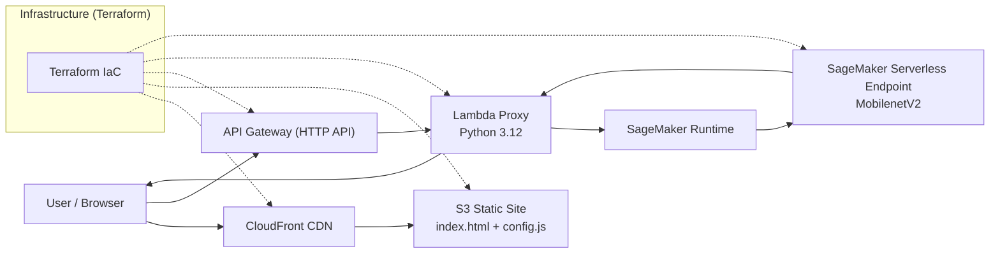

```mermaid
flowchart LR
  U["User / Browser"] --> CF["CloudFront CDN"]
  CF --> S3["S3 Static Site<br/>index.html + config.js"]

  U --> APIGW["API Gateway (HTTP API)"]
  APIGW --> LBD["Lambda Proxy<br/>Python 3.12"]

  LBD --> SMRT["SageMaker Runtime"]
  SMRT --> SMEND["SageMaker Serverless Endpoint<br/>MobilenetV2"]

  SMEND --> LBD
  LBD --> U

  subgraph Infra["Infrastructure (Terraform)"]
    TF["Terraform IaC"]
  end

  TF -.-> CF
  TF -.-> S3
  TF -.-> APIGW
  TF -.-> LBD
  TF -.-> SMEND
```