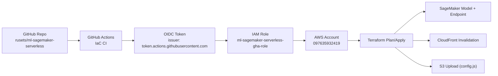

```mermaid
flowchart LR
  GH["GitHub Repo<br/>rusets/ml-sagemaker-serverless"] --> ACT["GitHub Actions<br/>IaC CI"]

  ACT --> OIDC["OIDC Token<br/>issuer: token.actions.githubusercontent.com"]
  OIDC --> IAM["IAM Role<br/>ml-sagemaker-serverless-gha-role"]

  IAM --> AWS["AWS Account<br/>097635932419"]

  AWS --> TFAPPLY["Terraform Plan/Apply"]
  TFAPPLY --> SM["SageMaker Model + Endpoint"]
  TFAPPLY --> CF["CloudFront Invalidation"]
  TFAPPLY --> S3["S3 Upload (config.js)"]
```