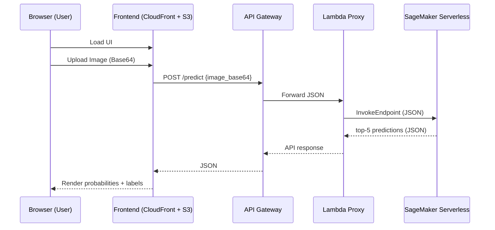

```mermaid
sequenceDiagram
  participant U as Browser (User)
  participant FE as Frontend (CloudFront + S3)
  participant API as API Gateway
  participant L as Lambda Proxy
  participant SM as SageMaker Serverless

  U->>FE: Load UI
  U->>FE: Upload Image (Base64)

  FE->>API: POST /predict {image_base64}

  API->>L: Forward JSON
  L->>SM: InvokeEndpoint (JSON)

  SM-->>L: top-5 predictions (JSON)
  L-->>API: API response
  API-->>FE: JSON
  FE-->>U: Render probabilities + labels
```